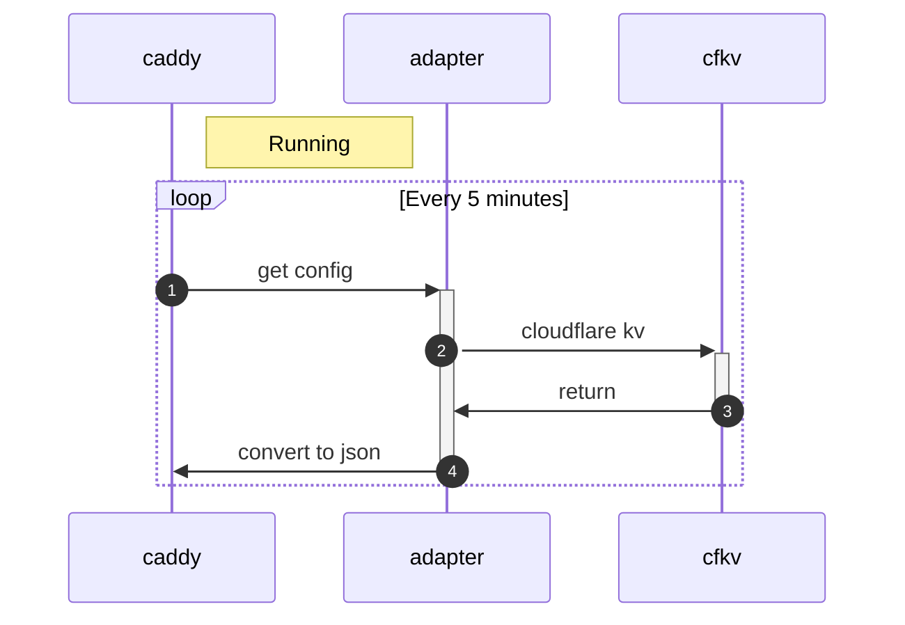

# caddy-cfkv-adapter
Using Cloudflare KV to store Caddy server configuration


## Using

using /etc/caddy/Caddyfile for init

## 

ID: public IP

```
CADDY_${ID}_SRV_1: {vhost1 caddyfile} 
CADDY_${ID}_SRV_2: {vhost2 caddyfile}
CADDY_${ID}_CADDYFILE: {Caddyfile}
CADDY_${ID}_UDPATEAT: [0]
```

### How to add VHost3

```
CADDY_${ID}_SRV_3: {vhost3 caddyfile}
CADDY_${ID}_UDPATEAT: [now timestamp]
```

### How to update Vhost3

```
CADDY_${ID}_SRV_3: {vhost3 caddyfile}
CADDY_${ID}_UDPATEAT: [now timestamp]
```

### How to delete VHost3

```
DEL -> CADDY_${ID}_SRV_3
CADDY_${ID}_UDPATEAT: [now timestamp]
```

## Sequence diagram


